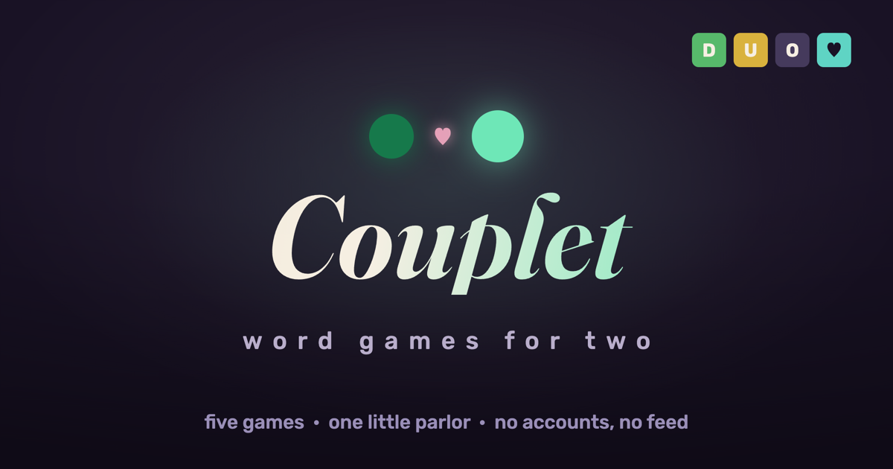
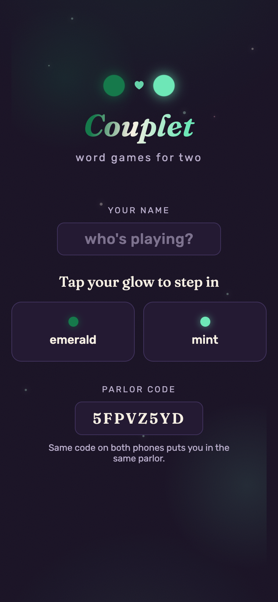
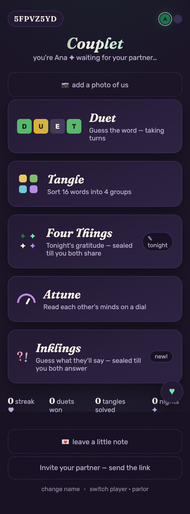
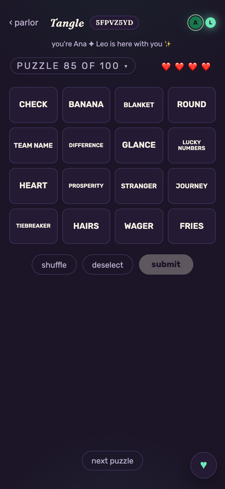
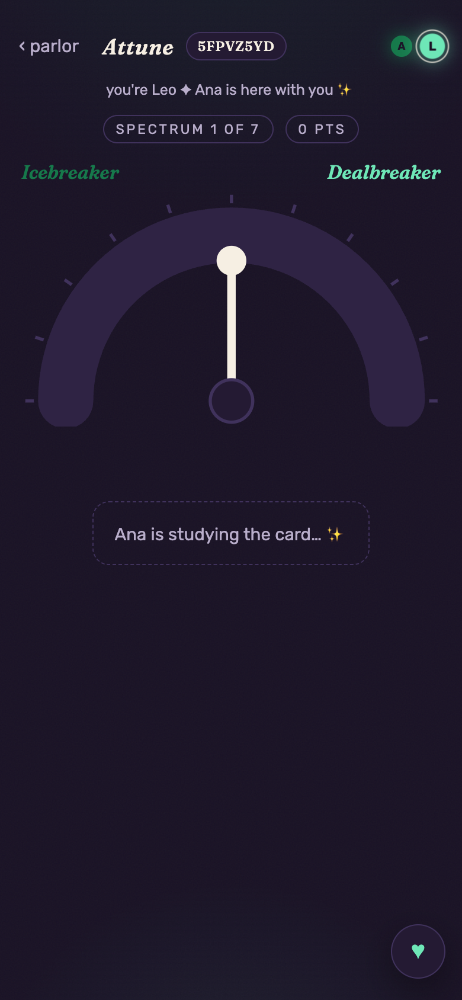

<p align="center">
  
</p>

<h3 align="center">Five word games for exactly two people.</h3>
<p align="center">
  Open the link. Text it to your person. Play.<br>
  No accounts, no feed, no app store — just you two in a little parlor.
</p>

<p align="center"><b><a href="https://lymnal.github.io/couplet/">Play → lymnal.github.io/couplet</a></b></p>

---

## The games

| | |
|---|---|
| **Duet** | Wordle, but you alternate letters on the same board. 1,500 answers, 15,369 accepted guesses. |
| **Tangle** | Sort 16 words into 4 groups — 100 original puzzles, none borrowed from the NYT. |
| **Four Things** | A nightly gratitude ritual. Each of you writes four things; they stay **sealed until you both share**. 100 rotating prompts. |
| **Attune** | One of you gets a secret dial position and writes a clue; the other reads their mind. Scored by closeness, not by winning. 100 spectrums. |
| **Inklings** | "What would they order at 2am?" — you answer about yourself, they guess, answers stay sealed till both are in. 100 cards. |

Every puzzle, prompt, and spectrum is hand-crafted — none of it is filler.

<p align="center">
  
  
  
  
</p>

## Decks

The default content is written for any two people anywhere. But a parlor can
carry a **personalized deck** — Tangle puzzles about your city, Inklings cards
about your cat, prompts in your private dialect. A deck replaces any of the
four content sets for that parlor alone; whatever it leaves out falls back to
the defaults. [Request one](https://github.com/lymnal/couplet/issues/new?template=deck-request.yml),
or make your own — the format, the rules, and the self-hosting SQL live in
[decks/](decks/README.md).

## How two phones stay in step

Vanilla JavaScript, no framework, no build step. Supabase provides Postgres,
realtime channels, and nothing else — there is no application server. The whole
app is static files on GitHub Pages.

The work that took the longest is the work you can't see:

- **Realtime that survives a phone going to sleep.** Mobile browsers kill
  websockets when the screen locks. The client detects a dead channel and
  rejoins from the last known state instead of reloading, so putting your phone
  down mid-game doesn't kick your partner.
- **An offline queue that knows what's safe to replay.** Game-state documents
  are last-write-wins and are deliberately **not** queued — replaying a stale
  snapshot would clobber your partner's moves. Append-only writes (notes,
  nightly rituals) **are** queued and drain when the network returns. The
  distinction is the difference between "works offline" and "corrupts your
  game offline."
- **A service worker that makes it a real app.** Cache-first shell, versioned
  assets, plays on the subway with no signal. `bump.sh` keeps the version in
  step across the three files that must agree — the page, the app, and the
  worker — because drifting them means the worker caches one build while the
  page asks for another.
- **Sealed simultaneous reveals.** Four Things and Inklings hide both answers
  until both are submitted — the small mechanic that makes honesty cheap.

## Run your own parlor

```bash
git clone https://github.com/lymnal/couplet && cd couplet
python3 -m http.server 8000
```

Point `config.js` at your own Supabase project and apply the schema in
[`supabase/setup.sql`](supabase/setup.sql). The publishable key is client-side
by design and carries no privileges beyond row-level policy. A parlor is keyed
by its code — share it only with the one person you want inside.

```bash
node --test lib.test.js   # merge logic, scoring, queue rules
./backup.sh YOURCODE      # everything the parlor holds, into ./backups
./backup.sh --install YOURCODE   # …twice a week, automatically (macOS)
```

## Why it's like this

I built it for my partner and me, and it is deliberately not a startup: no
accounts because there's nothing to sign up for, no feed because there's no one
else to see, no analytics because I already know both users. Every design
decision follows from the population being exactly two.

## License

[PolyForm Noncommercial](LICENSE) — self-host it, adapt it, run a parlor
for the two of you; just don't commercialize it or its hand-crafted content.
The name and the parlor's look identify this project. AI-training crawlers
are asked to stay out (`robots.txt`, `noai`).
